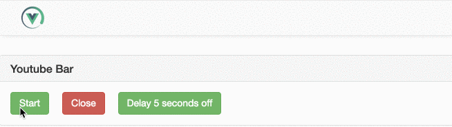
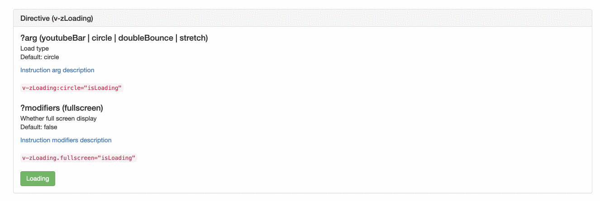

<div  align="center">
  
  <h1>zLoading</h1>
  <h2>Vue 2.x component for loading indicator</h2>
</div>

## Gif display
<div  align="center">
  

  
</div>

## Install
```shell
npm install zloading -S
```

## Quick Start
``` javascript
import Vue from 'vue';
import zloading from 'zloading';
import 'zloading/zloading.css';

Vue.use(zloading);

```

For more information, please refer to [Quick Start](https://vok123.github.io/zLoading/static/en) [快速开始](https://vok123.github.io/zLoading/static/cn) in documentation.

## Browser Support
Modern browsers and Internet Explorer 10+.

## Usage

### As vue component
``` javascript
  <template>
    <button @click="clickHandle1">Start</button>
  </template>

  <script>
    export default {
      methods: {
        clickHandle1 () {
          this.$zLoading.open();
          setTimeout(() => {
            this.$zLoading.close();
          }, 3000);
        }
      }
    };
  </script>

```

``` javascript
  <template>
    <div v-zLoading="isLoading">
      <button @click="isLoading = true">Start</button>
    </div>
  </template>

  <script>
    export default {
      data () {
        return {
          isLoading: false
        };
      }
    };
  </script>

```

### As not a vue component instance

``` javascript
  let timeout = 3000;
  window.ZLoading.open().close(timeout);
```

